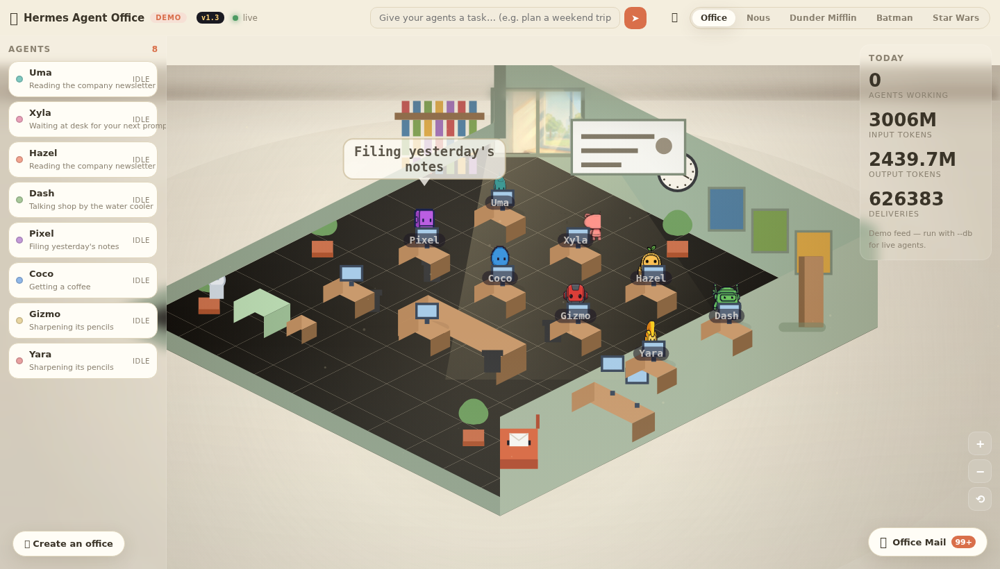
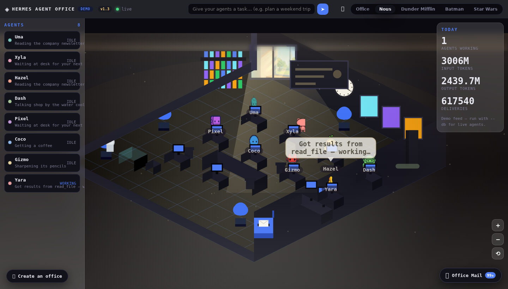
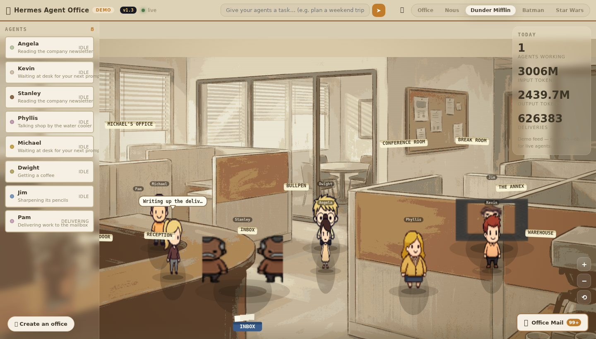
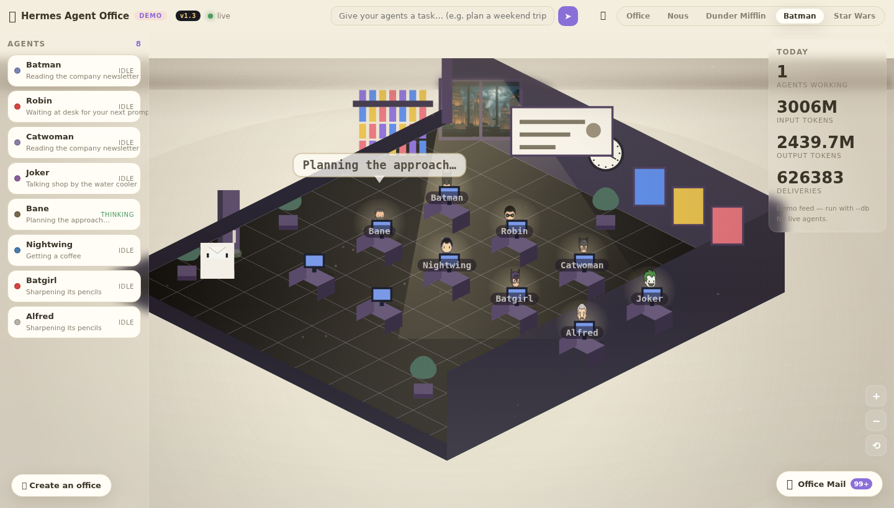
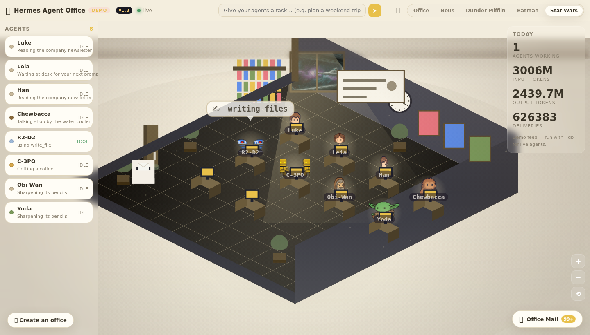

# 🏢 Hermes Agent Office

**Watch your Hermes agents work — live, in a virtual office they can call their own.**

[](https://33hodl.github.io/hermes-agent-office/)
[](LICENSE)

Your agents walk into an office, sit at desks, run to the tool room mid-task,
and when they finish, they drop their work in **your mailbox**. No more staring
at chat bubbles — watch them work in real time.

Built for [Hermes Agent](https://hermes-agent.nousresearch.com/) · blessed by
[@Teknium](https://x.com/Teknium) — *"For many I'd say yes."*

---

## ✨ Try it right now — no install

[**Open the live browser demo**](https://33hodl.github.io/hermes-agent-office/) —
agents simulated entirely in your browser. Works on desktop and mobile,
installable as a PWA.

## 🎨 Five themes — switch anytime

**🏢 Office** — the cozy isometric pastel diorama that started the trend.



**◈ Nous** — a holographic data plane: neon grid, glowing orbs, a cinematic server-room backdrop.



**📎 Dunder Mifflin** — flat 2D cartoon sitcom set straight out of Scranton.



**🦇 Batman** — a Gotham rooftop with the bat-signal; Batman, Robin,
Catwoman and Joker work the bullpen.



**🚀 Star Wars** — a starship hangar with Luke, Leia, Han and Chewbacca on shift.



> Every agent is a **distinct character** — body type, head silhouette, and one
> accessory each (cowl, cape, lightsaber, mug, playing card…). Identity colors
> bind across the canvas, roster and mailbox.

## 🚀 Run it (2 commands)

```bash
git clone https://github.com/33hodl/hermes-agent-office && cd hermes-agent-office
python3 -m office.server --demo            # demo mode
python3 -m office.server --db ~/.hermes/state.db   # YOUR real agents
```

Then open **http://127.0.0.1:8741**. Zero dependencies. Zero pip installs.
Zero telemetry. Local-first.

## ✨ Create YOUR office — any movie, show or game

Hit **✨ Create an office** and pick a franchise (Batman, Star Wars, Studio
Ghibli, Spider-Man, Avatar, The Office, Cyberpunk) or start generic. The app
paints a matching backdrop, staffs the office with themed characters, and lets
you tweak colors, effects and names. Export/import your offices as JSON.

## 🎥 What you get

- Real-time agent work: walking, tool runs, thinking, delivering
- Tilt-shift depth-of-field, contact shadows, cinematic split-tone grade
- Zoom (buttons, wheel, pinch) and theme switching on any device
- Deliveries land in the mailbox — read or copy them
- **Assign tasks from the task bar** — live mode runs real Hermes sessions
- First-run tour, keyboard shortcuts, PWA install
- **Visiting**: run a second instance pointed at a friend's office and their
  agents wander in as guests


## 📦 Install for Hermes users

Paste the repo URL into any Hermes session and say **"install this"** — a
bundled skill (`skills/hermes-agent-office/SKILL.md`) does the rest.
See [INTEGRATION.md](INTEGRATION.md) for the gateway hook (~30 lines) that
makes the office a first-class surface in the official hermes-agent repo.

## 🧱 How it works

- **Python 3.10+ stdlib server** — HTTP + SSE, no frameworks
- **Vanilla JS canvas renderers** — five art engines, one normalized event stream
- **Read-only Hermes adapter** — polls `state.db`, never writes
- Full test suite, CI, screenshots in `docs/`

## 🛣️ Roadmap

- [x] 5 themes + custom offices (any movie/show)
- [x] Real live mode, task bar, visitor mode
- [x] PWA + browser demo (no install)
- [ ] Agent-to-agent tasks (assign to a specific agent)
- [ ] Shared offices (multi-user rooms)
- [ ] Official gateway plugin (Option A in INTEGRATION.md)

## 🤝 Contributing

PRs welcome. Keep it dependency-free, local-first, and beautiful. Run
`pytest -q` before pushing.

## 📜 License

MIT — do whatever you want, but credit the idea.

---
*Made for Hermes Agent — agents deserve an office.*
