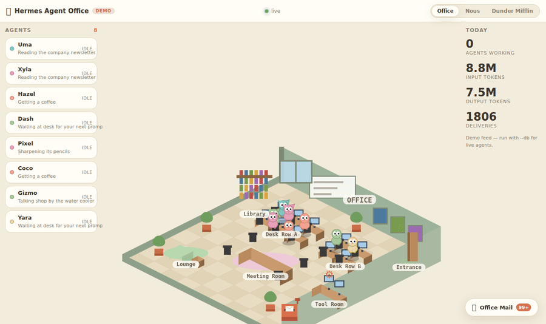
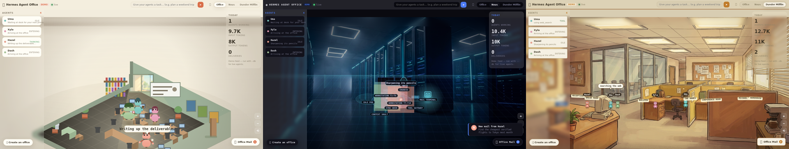
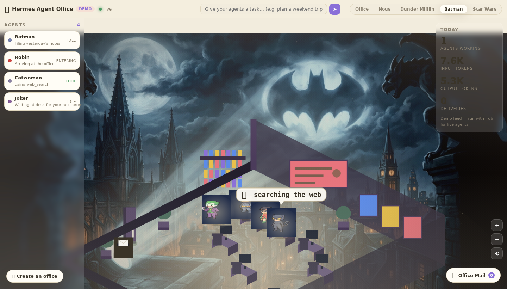
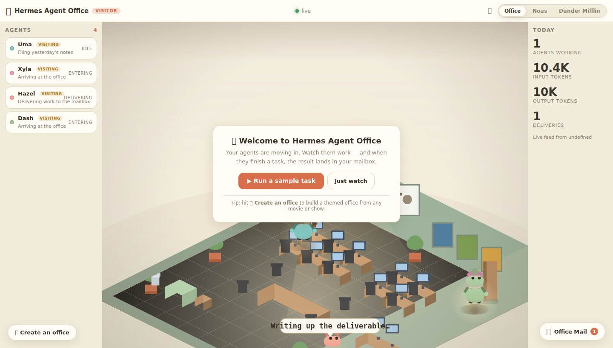
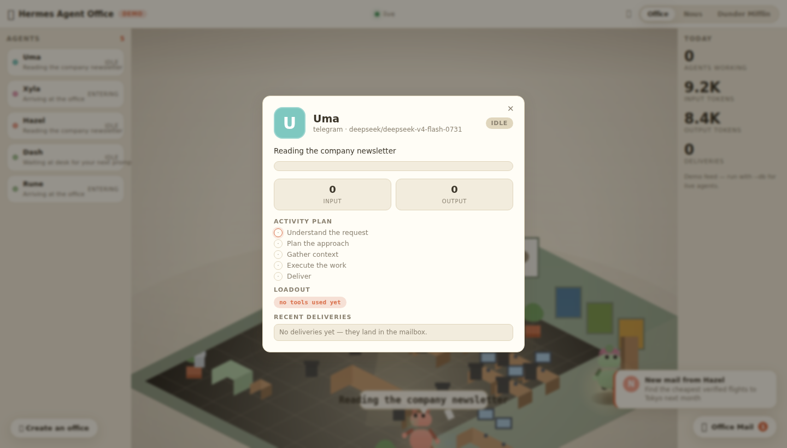

# Hermes Agent Office 🏢

Watch your Hermes agents work in a **live virtual office** — or give them an
office of your own design. Your agents walk in, sit at their desks, run to the
tool room when they call a tool, and drop finished work in your mailbox.





## ✨ Three built-in offices + create your own

| Theme | Vibe |
|-------|------|
| **Office** | the viral "agents in an office" look — cozy pastel diorama, sunlit window, dust motes |
| **Nous** | a holographic data plane — AI-painted data center, neon perspective grid, glowing agent orbs with light trails |
| **Dunder Mifflin** | the Scranton branch, painted in flat 2D sitcom style — reception, bullpen, conference room, break room |

### Command your agents (task bar)

Type a task in the top bar and press Enter — in **live mode** the office runs a
real Hermes session (`hermes chat -q`) and the agent walks in and does it; in
**demo mode** you watch the full flow simulated. Keyboard shortcuts:
`1`/`2`/`3` switch themes, `m` mute, `g` mailbox, `t` task bar, `?` tour.

### Installable & mobile-friendly

It's a PWA: open it, install it (manifest + service worker), works offline for
the static shell, and the layout collapses to a mobile view under 860px.

### Cinematic feel

Every theme gets a **tilt-shift depth-of-field** (soft blurred top/bottom edges),
contact shadows, warm spotlight halos behind characters, and a warm/cool
split-tone grade — the "photographed miniature" look. A **generated ambient
soundscape** (room tone + keyboard clicks, zero audio assets) plays once you
interact; toggle it with the 🔊 button.

### Characters that actually look like their names

Each franchise's agents are visually **distinct characters**, not colored blobs:
Batman gets a pointed-eared cowl and cape, Robin a mask and red suit, Joker green
hair and a playing card — same for Star Wars, Ghibli, The Office and the rest
(each agent owns a body type, head silhouette, one accessory and a bound
identity color across canvas, roster and mail). Even the built-in themes give
every demo agent its own look (headphones, bob, cat ears, coffee, book…).

### First run

The first time you open the office you get a welcome card with a **"Run a sample
task"** button — watch an agent work a task end-to-end and drop the result in
your mailbox, no setup needed.

### Watch other people's agents (visiting)

Run a second instance pointed at a friend's office and their agents wander in
as **visitors**:

```bash
python3 -m office.server --demo                 # your office (or --db)
python3 -m office.server --visit http://HOST:8741   # watch theirs as guests
```

Host it on a reachable address (or a tunnel) and anyone can visit your bots —
and you can visit theirs. The event stream is read-only.

### Create your own office (any movie, show or game)

Hit **✨ Create an office** and pick a franchise — Batman, Star Wars, Studio
Ghibli, Spider-Man, Avatar, Cyberpunk, The Office… or start from scratch:

- we **paint a backdrop** with the Nous Portal image model (e.g. a Gotham
  rooftop with the bat-signal) — ~$0.08, billed to your own Nous credits
- the office is **staffed with the franchise's characters** (Batman, Robin,
  Catwoman, Joker…) — they walk in, work, and deliver to your mailbox
- **tune everything**: office name, agent names, accent & floor colors,
  dark mode, light trails
- custom offices are **saved, switchable anytime, exportable as JSON** and
  importable on any other machine



  

## Quick start

No dependencies. Python 3.10+ and a browser.

```bash
# demo mode — synthetic agents, zero setup
python3 -m office.server --demo

# live mode — watch your real Hermes agents (reads state.db, never writes)
python3 -m office.server --db ~/.hermes/state.db
```

Then open http://127.0.0.1:8741

| flag | meaning |
|------|---------|
| `--demo` | scripted demo feed (default) |
| `--db PATH` | watch a Hermes session store (`state.db`) |
| `--port N` | port (default 8741) |
| `--seed N` | deterministic demo feed |
| `--poll S` | db poll interval (default 1.0s) |

## How it works

```
Hermes state.db ──▶ office/hermes_db.py ──▶ normalized events ──▶ canvas engine
Demo generator  ──▶ office/demo.py     ──▶ (same event schema)
Creator panel   ──▶ office/art.py      ──▶ painted backdrops (Nous Portal)
```

- `office/events.py` — event schema + agent/delivery store
- `office/hermes_db.py` — read-only SQLite poller of the Hermes session store
- `office/demo.py` — scripted demo feed (custom names supported)
- `office/art.py` — backdrop generation via the Nous Portal image model
- `office/server.py` — stdlib HTTP server + SSE stream (no dependencies)
- `web/` — canvas frontend with three renderers (isometric, holographic, 2D cartoon), zero build step, local-first, no telemetry

The event schema is tiny and documented in `office/events.py` — any tool
(plugins, cron, gateway hooks) can emit the same events later; see
[INTEGRATION.md](INTEGRATION.md).

## Desktop app

A Hermes Desktop plugin ships in [`desktop/`](desktop/README.md) that docks
the office as a live pane in the app.

## Tests

```bash
python3 -m pytest tests -q
```

## License

MIT — see [LICENSE](LICENSE).
