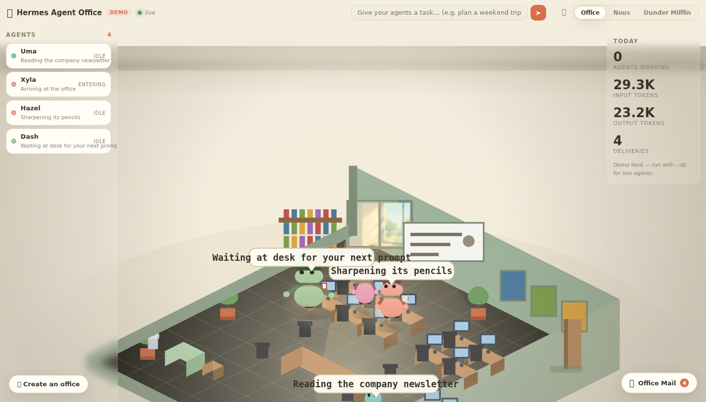
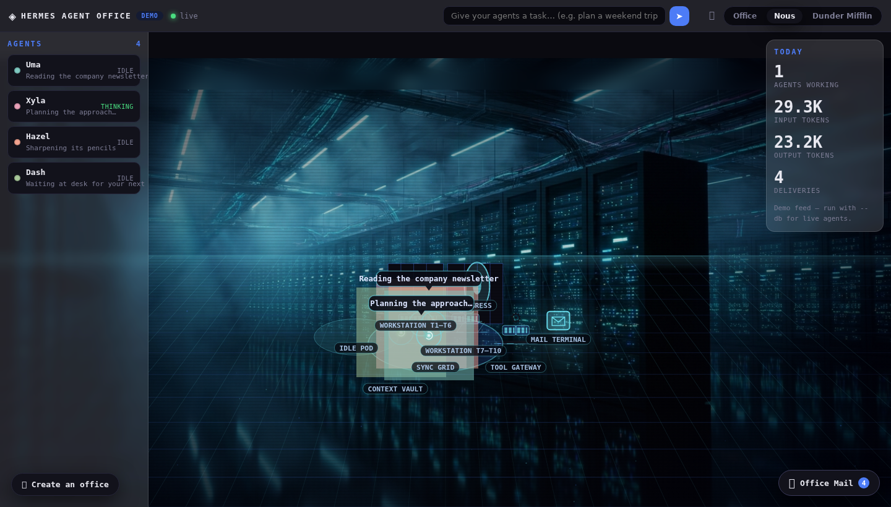
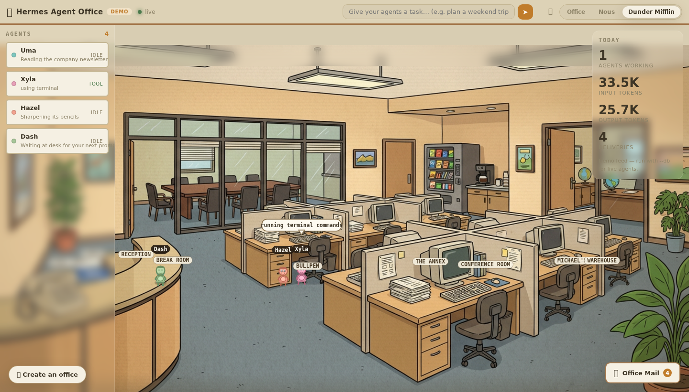
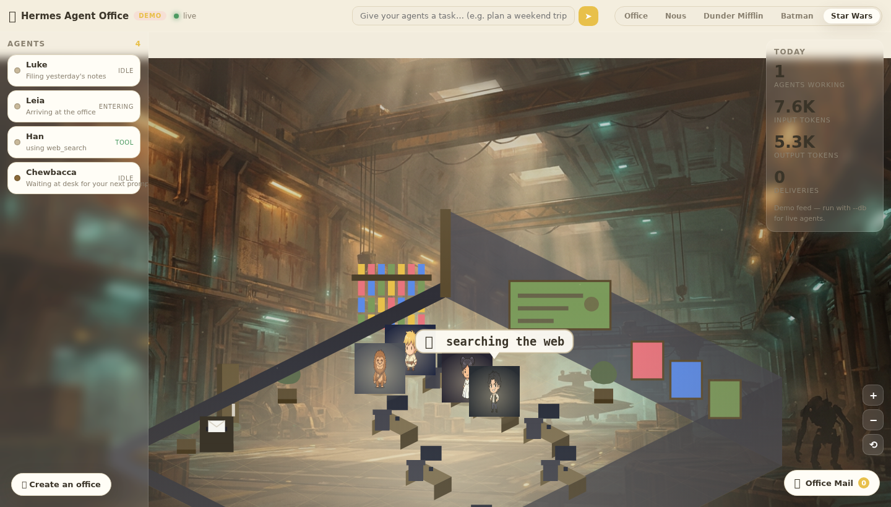

# 🏢 Hermes Agent Office

**Watch your Hermes agents work — live, in a virtual office they can call their own.**

[](https://33hodl.github.io/hermes-agent-office/)
[](LICENSE)
[]()
[]()


Your agents walk into an office, sit at desks, run to the tool room mid-task,
and when they finish, they drop their work in **your mailbox**. No more staring
at chat bubbles — watch them work in real time.

Built for [Hermes Agent](https://hermes-agent.nousresearch.com/) · blessed by
[@Teknium](https://x.com/Teknium) — *"For many I'd say yes."*

---

## ✨ Try it right now — no install

[**Open the live browser demo**](https://33hodl.github.io/hermes-agent-office/) —
agents simulated entirely in your browser. Installable as a PWA.

## 🚀 2 commands to run it

```bash
bash <(curl -s https://raw.githubusercontent.com/33hodl/hermes-agent-office/master/scripts/install.sh)
```

…or manually:

```bash
git clone https://github.com/33hodl/hermes-agent-office && cd hermes-agent-office
python3 -m office.server --demo            # demo mode
python3 -m office.server --db ~/.hermes/state.db   # YOUR real agents
```

Then open **http://127.0.0.1:8741**. Zero dependencies. Zero pip installs.
Zero telemetry. Local-first.

## 🎨 Three hand-crafted themes — pick your vibe

Every theme ships with its own art engine: distinct characters with their own
silhouettes and props, cinematic tilt-shift depth-of-field, contact shadows
and a warm/cool split-tone grade. Switch anytime with the tabs (or `1`/`2`/`3`).

**🏢 Office** — the cozy isometric pastel diorama that started the trend.
Sunlit window, dust motes, agents with headphones, bobs and coffee cups.



**◈ Nous** — a holographic data plane: neon perspective grid, glowing orb
agents with light trails, a painted data-center backdrop. Built for the
Hermes aesthetic.



**📎 Dunder Mifflin** — a flat 2D cartoon sitcom set straight out of Scranton:
reception, bullpen, conference room, break room, Michael's office — and the
world's best boss mug.



## ✨ Create YOUR office — any movie, show or game

Hit **✨ Create an office** and pick a franchise: Batman, Star Wars, Studio
Ghibli, Spider-Man, Avatar, The Office, Cyberpunk — or start generic and make
it anything. The app paints a matching backdrop with AI, staffs the office
with **characters that actually look like their names**, and lets you tweak
colors, effects, agent names and station labels. Export your office as JSON,
share it, import a friend's.

**🦇 Batman Office** — Gotham rooftop, bat-signal, and Batman, Robin,
Catwoman and Joker working the bullpen (cowl, cape, mask, green hair and
playing cards included).


**🚀 Star Wars Office** — a starship hangar, and Luke, Leia, Han and
Chewbacca filing reports next to a droid with a lightsaber.



> Screenshots + demo GIF are regenerated by `scripts/refresh-screenshots.sh`
> (requires ffmpeg + playwright) — so the README never shows stale visuals.

## 🎥 What you get

- Real-time agent work: walking, tool runs, thinking, delivering
- Tilt-shift depth-of-field, contact shadows, cinematic split-tone grade
- Generated ambient soundscape (room tone + keyboard clicks, zero assets)
- Deliveries land in the mailbox — read or copy them
- **Assign tasks from the task bar** — live mode runs real Hermes sessions
- Agent details: role, model, loadout, recent deliveries
- First-run tour, keyboard shortcuts, PWA install, mobile layout
- **Visiting**: run a second instance pointed at a friend's office and their
  agents wander in as guests — and vice versa

## 🎥 See it move


[▶ Watch the 9s promo video](docs/screenshots/promo.mp4)

## 📦 Install for Hermes users

Paste the repo URL into any Hermes session and say **"install this"** — a
bundled skill (`skills/hermes-agent-office/SKILL.md`) does the rest.
See [INTEGRATION.md](INTEGRATION.md) for the gateway hook (~30 lines) that
makes the office a first-class surface in the official hermes-agent repo.

## 🧱 How it works

- **Python 3.10+ stdlib server** — HTTP + SSE, no frameworks
- **Vanilla JS canvas renderers** — three distinct art engines, one normalized event stream
- **Read-only Hermes adapter** — polls `state.db`, never writes
- Full test suite, CI, screenshots in `docs/`

## 🛣️ Roadmap

- [x] 3 themes + custom offices (any movie/show)
- [x] Real live mode, task bar, visitor mode
- [x] PWA + browser demo (no install)
- [ ] Agent-to-agent tasks (assign to a specific agent)
- [ ] Shared offices (multi-user rooms)
- [ ] Official gateway plugin (Option A in INTEGRATION.md)

## 🤝 Contributing

PRs welcome. Keep it dependency-free, local-first, and beautiful. Run
`pytest -q` before pushing.

## 📜 License

MIT — do whatever you want, but credit the idea.

---
*Made for Hermes Agent — agents deserve an office.*
