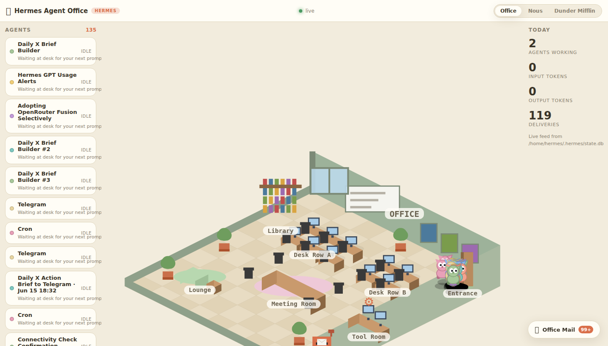

# Hermes Agent Office 🏢

Watch your Hermes agents work in a live virtual office. No more staring at
chat bubbles — your agents walk in, sit at their desks, run to the tool room
when they call a tool, and drop finished work in your mailbox. Three office
themes included.


## What it is

Hermes Agent runs everywhere — Telegram, Discord, cron, CLI, desktop — and
its sessions are stored locally in `state.db`. Hermes Agent Office reads that
store (read-only, zero writes) and turns the activity into an animated,
isometric office:

- agents arrive when sessions start, leave when they end
- status bubbles: *thinking…*, *searching the web*, *editing files*, *waiting at desk*
- every tool call sends the agent to the tool room
- finished work lands in your mailbox as a clickable delivery
- live token counters and per-agent activity plans



## Quick start

No dependencies. Python 3.10+ and a browser.

```bash
# demo mode — synthetic agents, zero setup, try it instantly
python3 -m office.server --demo

# live mode — watch your real Hermes agents
python3 -m office.server --db ~/.hermes/state.db
```

Then open http://127.0.0.1:8741

| flag | meaning |
|------|---------|
| `--demo` | scripted demo feed (default) |
| `--db PATH` | watch a Hermes session store (`state.db`) |
| `--port N` | port (default 8741) |
| `--seed N` | deterministic demo feed |
| `--poll S` | db poll interval (default 1.0s) |

## Themes

| Theme | Vibe |
|-------|------|
| **Office** | the viral "agents in an office" look — cozy pastel diorama |
| **Nous** | premium dark, cobalt grid, terminal energy |
| **Dunder Mifflin** | the Scranton branch — reception, bullpen, conference room, break room, warehouse |

Switch themes in-app (top right); the choice persists.

## How it works

```
Hermes state.db ──▶ office/hermes_db.py ──▶ normalized events ──▶ web canvas
Demo generator  ──▶ office/demo.py    ──▶ (same event schema)
```

- `office/events.py` — event schema + agent/delivery store
- `office/hermes_db.py` — read-only SQLite poller of the Hermes session store
- `office/demo.py` — scripted demo feed
- `office/server.py` — stdlib HTTP server + SSE stream (no dependencies)
- `web/` — canvas frontend, zero build step, local-first, no telemetry

The event schema is tiny and documented in `office/events.py` — any tool
(plugins, cron, gateway hooks) can emit the same events later; see
[INTEGRATION.md](INTEGRATION.md).

## Desktop app

A Hermes Desktop plugin ships in [`desktop/`](desktop/README.md) that docks
the office as a live pane in the app.

## Tests

```bash
python3 -m pytest tests -q
```

## License

MIT — see [LICENSE](LICENSE).
